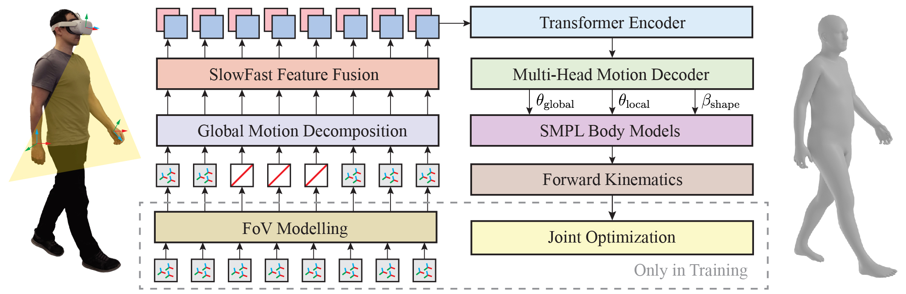

# EgoPoser (ECCV 2024, Official Code)
#### EgoPoser: Robust Real-Time Egocentric Pose Estimation from Sparse and Intermittent Observations Everywhere
[Jiaxi Jiang](https://www.jiaxi-jiang.com/), [Paul Streli](https://www.paulstreli.com), [Manuel Meier](http://northwards.ch/), [Christian Holz](https://www.christianholz.net)<br/>

[Sensing, Interaction & Perception Lab](https://siplab.org), Department of Computer Science, ETH Zürich, Switzerland <br/>

[](https://siplab.org/projects/EgoPoser)
[](https://arxiv.org/abs/2308.06493)

<p align="center">

</p>

___________

Abstract
----------
> Full-body egocentric pose estimation from head and hand poses alone has become an active area of research to power articulate avatar representations on headset-based platforms. However, existing methods over-rely on the indoor motion-capture spaces in which datasets were recorded, while simultaneously assuming continuous joint motion capture and uniform body dimensions. We propose EgoPoser to overcome these limitations with four main contributions. 1) EgoPoser robustly models body pose from intermittent hand position and orientation tracking only when inside a headset's field of view. 2) We rethink input representations for headset-based ego-pose estimation and introduce a novel global motion decomposition method that predicts full-body pose independent of global positions. 3) We enhance pose estimation by capturing longer motion time series through an efficient SlowFast module design that maintains computational efficiency. 4) EgoPoser generalizes across various body shapes for different users. We experimentally evaluate our method and show that it outperforms state-of-the-art methods both qualitatively and quantitatively while maintaining a high inference speed of over 600fps. EgoPoser establishes a robust baseline for future work where full-body pose estimation no longer needs to rely on outside-in capture and can scale to large-scale and unseen environments.

Method Overview
----------



Contents
----------

* [Installation](#installation)
* [Datasets](#datasets)
* [Training](#training)
* [Testing](#testing)
* [Pretrained Models](#pretrained-models)
* [Citation](#citation)
* [License](#license)

Installation
----------
1. Clone this project.
```
git clone https://github.com/eth-siplab/EgoPoser
```

2. Environment

You can install the conda environment by:
```
conda env create -f environment.yml
conda activate egoposer
```
or through pip:
```
pip install -r requirements.txt
```
We test our code on Python 3.10.0.

Datasets
----------
We adapt the data processing code from [AvatarPoser](https://github.com/eth-siplab/AvatarPoser) and use the same data split:
1. Please download the datasets `BMLrub`, `CMU`, and `HDM05` from [AMASS](https://amass.is.tue.mpg.de/index.html).
2. Download the required body model and placed them in `support_data/body_models` directory of this repository. For SMPL+H body model, download it from http://mano.is.tue.mpg.de/. Please download the AMASS version of the model with DMPL blendshapes. You can obtain dynamic shape blendshapes, e.g. DMPLs, from http://smpl.is.tue.mpg.de
3. Run `prepare_data.py` to preprocess the input data for faster training. The data split for training and testing data in our paper is stored under the folder `data_split`.
4. If you want to test the performance on the HPS dataset, please first download the dataset by clicking on ["HPS result"](https://edmond.mpg.de/file.xhtml?fileId=274749) from [HPS Dataset Website](https://virtualhumans.mpi-inf.mpg.de/hps/download_and_license.html), and then run `prepare_data_hps.py` to preprocess the data.

Training
----------
To train a model with hand tracking signals always available, please run:
```
python main_train.py -opt options/train_egoposer.yaml
```

To train a model with hand tracking, please run:
```
python main_train.py -opt options/train_egoposer_handtracking.yaml
```

To train a model for the HPS dataset (30 FPS), please run
```
python main_train.py -opt options/train_egoposer_30fps.yaml
```

Testing
----------
For testing, please run one of the following commands:
```
python main_test.py -opt options/test_egoposer.yaml	# for full hand visibility
```
```
python main_test.py -opt options/test_egoposer_handtracking.yaml	# for partial hand visibility
```
```
python main_test.py -opt options/test_egoposer_hps.yaml	# for HPS dataset
```
Pretrained Models
----------
We provide our pre-trained models on [Google Drive](https://drive.google.com/drive/folders/1b0tc4T8z6vasy7AksYlfw--6dWfzH8wT?usp=drive_link) for EgoPoser. Download the models and put them into `model_zoo`.

Citation
----------

If you find our paper or codes useful, please cite our work:

	@inproceedings{jiang2024egoposer,
	  title={EgoPoser: Robust real-time egocentric pose estimation from sparse and intermittent observations everywhere},
	  author={Jiang, Jiaxi and Streli, Paul and Meier, Manuel and Holz, Christian},
	  booktitle={European Conference on Computer Vision},
	  year={2024},
	  organization={Springer}
	}	  

    @inproceedings{jiang2022avatarposer,
      title={AvatarPoser: Articulated Full-Body Pose Tracking from Sparse Motion Sensing},
      author={Jiang, Jiaxi and Streli, Paul and Qiu, Huajian and Fender, Andreas and Laich, Larissa and Snape, Patrick and Holz, Christian},
      booktitle={Proceedings of European Conference on Computer Vision},
      year={2022},
      organization={Springer}
    }
 

## License
This project is released under the MIT license. Our code is based on our previous project [AvatarPoser (ECCV'22)](https://github.com/eth-siplab/AvatarPoser).
